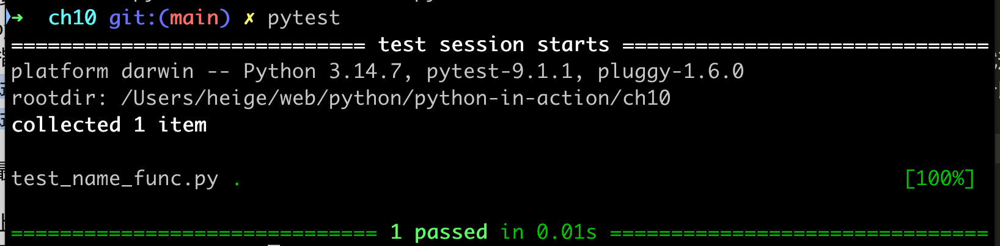
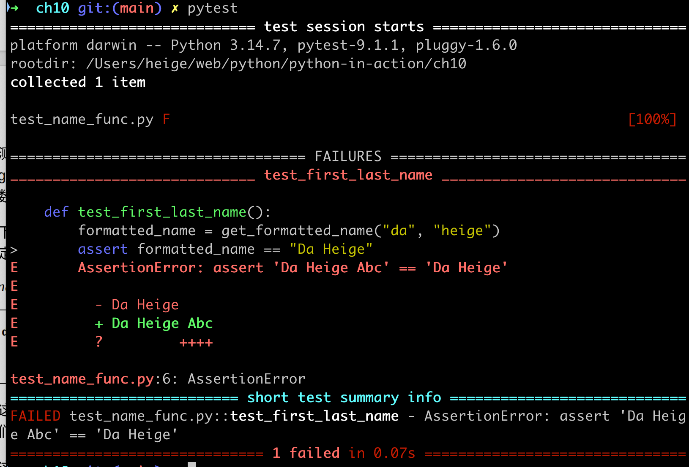

# 测试
在编写函数或类时，还可为其编写测试。通过测试，可确定代码⾯对各种输⼊都能够按要求⼯作。
测试让你坚信，⽆论有多少⼈使⽤你的程序，它都将正确地⼯作。在程序中添加新代码时，也可对其进⾏测试，
确认它们不会破坏程序既有的⾏为。程序员都会犯错，因此每个程序员都必须经常测试⾃⼰的代码，先于⽤户发现问题。

pytest 库是⼀组⼯具，不仅能帮助你快速⽽轻松地编写测试，⽽且能持续⽀持随项⽬增⼤⽽
变得复杂的测试。Python 默认不包含 pytest，因此你将学习如何安装外
部库。知道如何安装外部库让你能够使⽤各种设计良好的代码。这些库还
极⼤地增加了你可开发的项⽬类型。

# pytest 安装
1. 升级 pip
```shell
python3 -m pip install --upgrade pip --break-system-packages
```
2. 为当前用户安装pytest
```shell
python3 -m pip install --user pytest --break-system-packages
# 或者
pip3 install pytest --break-system-packages
```

## uv 安装 pytest
当然也可以使用uv工具安装 pytest
```shell
pip3 install uv --break-system-packages
```

一般来说，不建议 uv pip install --system pytest 装到系统环境
创建虚拟环境（推荐）
```shell
cd your_project
uv venv                      # 创建 .venv
source .venv/bin/activate    # Linux/macOS 激活
uv pip install pytest        # 安装 pytest
```

# 单元测试和测试⽤例
软件的测试⽅法多种多样。⼀种最简单的测试是单元测试（unit test），⽤
于核实函数的某个⽅⾯没有问题。测试⽤例（test case）是⼀组单元测试，
这些单元测试⼀道核实函数在各种情况下的⾏为都符合要求。良好的测试
⽤例考虑到了函数可能收到的各种输⼊，包含针对所有这些情况的测试。
全覆盖（full coverage）测试⽤例包含⼀整套单元测试，涵盖了各种可能的
函数使⽤⽅式。对于⼤型项⽬，要进⾏全覆盖测试可能很难。通常，最初
只要针对代码的重要⾏为编写测试即可，等项⽬被⼴泛使⽤时再考虑全覆
盖。

# 可通过的测试
使⽤ pytest 进⾏测试，会让单元测试编写起来⾮常简单。我们将编写⼀
个测试函数，它会调⽤要测试的函数，并做出有关返回值的断⾔。如果断
⾔正确，表⽰测试通过；如果断⾔不正确，表⽰测试未通过

测试⽂件的名称很重要，必须以
test_打头。当你让 pytest 运⾏测试时，它将查找以 test_打头的⽂件，并
运⾏其中的所有测试。

# 运行测试
如果直接运⾏⽂件 test_name_func.py，将不会有任何输出，因为我们没
有调⽤这个测试函数。相反，应该让 pytest 替我们运⾏这个测试⽂件。

打开⼀个终端窗⼝，并切换到这个测试⽂件所在的⽂件夹，然后运行pytest即可
```shell
cd ch10
pytest
```
输出结果如下：

```ini
============================= test session starts ==============================
platform darwin -- Python 3.14.7, pytest-9.1.1, pluggy-1.6.0
rootdir: /Users/heige/web/python/python-in-action/ch10
collected 1 item

test_name_func.py .                                                      [100%]

============================== 1 passed in 0.01s ===============================
```

⽂件名后⾯的句点表明有⼀个测试通过了，⽽ 100% 指出运⾏了所有的测试。在可能有数百乃⾄数千个测
试的⼤型项⽬中，句点和完成百分⽐有助于监控测试的运⾏进度。

对于未通过的测试会报错如下：

其中 E 指出了导致测试未通过的具体错误
```ini
test_name_func.py:6: AssertionError
=========================== short test summary info ============================
FAILED test_name_func.py::test_first_last_name - AssertionError: assert 'Da Heige Abc' == 'Da Heige'
```
此时，会的到具体的原因

在测试未通过时，该怎么办呢？如果检查的条件没错，那么测试通过意味
着函数的⾏为是对的，⽽测试未通过意味着你编写的新代码有错。因此，
在测试未通过时，不要修改测试。因为如果你这样做，即便能让测试通
过，像测试那样调⽤函数的代码也将突然崩溃。相反，应修复导致测试不
能通过的代码：检查刚刚对函数所做的修改，找出这些修改是如何导致函
数⾏为不符合预期的。

# 各种断⾔
测试中常用的断言语句

| 断言 | 用途 |
|------|------|
| `assert a == b` | 断言两个值相等 |
| `assert a != b` | 断言两个值不等 |
| `assert a` | 断言 a 的布尔求值为 `True` |
| `assert not a` | 断言 a 的布尔求值为 `False` |
| `assert element in list` | 断言元素在列表中 |
| `assert element not in list` | 断言元素不在列表中 |

# pytest 参数说明
pytest 默认会捕获 stdout，想看 print() 输出，加 -s 参数
```shell
pytest -s
```
或者
```shell
pytest --capture=no
```

其他常用捕获选项：

| 参数                   | 作用                                 |
| -------------------- | ---------------------------------- |
| `-s`                 | 完全禁用捕获，print 实时输出到终端               |
| `--capture=tee-sys`  | 既在终端显示，又写入捕获记录，配合 `--html` 报告时也有输出 |
| `--show-capture=all` | 测试失败时，在报告里显示捕获的 print 内容           |

注意区别：即使不加 -s，测试失败时 pytest 也会自动把捕获到的 print 内容显示在失败报告里；
只是成功的测试不会显示。如果只想在失败时看输出，其实什么参数都不用加。

还可以只在特定文件/用例上放开：
```shell
pytest -s test_name_func.py
pytest -s test_name_func.py::test_first_name
```

# 小结
测试是很多初学者并不熟悉的主题。作为初学者，你并⾮必须为⾃⼰尝试
的所有项⽬编写测试。但是，在参与⼯作量较⼤的项⽬时，应该对⾃⼰编
写的函数和类的重要⾏为进⾏测试。这样就能够确信，⾃⼰所做的⼯作不
会破坏项⽬的其他部分，让你能够随⼼所欲地改进既有的代码。如果不⼩
⼼破坏了原来的功能，你⻢上就会知道，从⽽能够轻松地修复问题。⽐起
等到不满意的⽤户报告 bug 后再采取措施，在测试未通过时采取措施要容
易得多。

如果你在项⽬中纳⼊了测试，其他程序员将更敬佩你。他们不仅能够更得
⼼应⼿地使⽤你编写的代码，也更愿意与你合作开发项⽬。要给其他程序
员开发的项⽬贡献代码，就必须证明你编写的代码通过了既有的测试，⽽
且通常需要为你添加的新⾏为编写测试。

请通过多多开展测试来熟悉代码测试过程。对于⾃⼰编写的函数和类，请
编写针对其重要⾏为的测试。但在早期的项⽬中，不必以编写全覆盖测试
⽤例为⽬标，除⾮有充分的理由。
