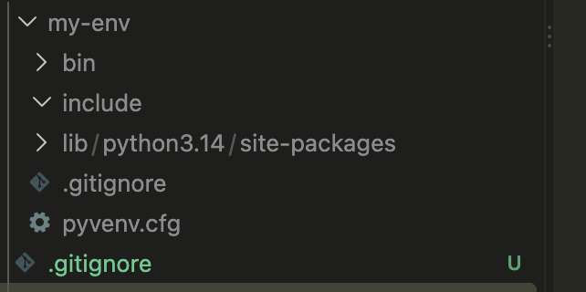

# 虚拟环境和包
Python 应用程序通常会使用不在标准库内的软件包和模块。应用程序有时需要特定版本的库，因为应用程序可能需要已修复某个特定错误的库版本，或者应用程序可能是使用了某个库的旧版接口编写的。

这意味着一个 Python 安装可能无法满足每个应用程序的要求。如果应用程序A需要特定模块的1.0版本但应用程序B需要2.0版本，则需求存在冲突，安装版本1.0或2.0将导致某一个应用程序无法运行。

这个问题的解决方案是创建一个 virtual environment，一个目录树，其中安装有特定 Python 版本，以及许多其他包。

然后，不同的应用将可以使用不同的虚拟环境。 要解决先前需求相冲突的例子，应用程序 A 可以拥有自己的安装了 1.0 版本的虚拟环境，而应用程序 B 则拥有安装了 2.0 版本的另一个虚拟环境。 如果应用程序 B 要求将某个库升级到 3.0 版本，也不会影响应用程序 A 的环境。

# 创建虚拟环境
用于创建和管理虚拟环境的模块是 venv。 venv 将安装运行命令所使用的 Python 版本（即 --version 选项所报告的版本）。 例如，使用 python3.12 执行命令将会安装 3.12 版。

要创建虚拟环境，请确定要放置它的目录，并将 venv 模块作为脚本运行目录路径:
```shell
python3 -m venv my-env
```
这将创建 my-env 目录，如果它不存在的话，并在其中创建包含 Python 解释器副本和各种支持文件的目录。

虚拟环境的常用目录位置是 .venv。 这个名称通常会令该目录在你的终端中保持隐藏，从而避免需要对所在目录进行额外解释的一般名称。 它还能防止与某些工具所支持的 .env 环境变量定义文件发生冲突。

创建虚拟环境后，您可以激活它。
```shell
source my-env/bin/activate
```

激活虚拟环境将改变你所用终端的提示符，以显示你正在使用的虚拟环境，并修改环境以使 python 命令所运行的将是已安装的特定 Python 版本。 例如：
```shell
python3 -m venv my-env
➜  ch12 git:(main) ✗ source my-env/bin/activate
(my-env) ➜  ch12 git:(main) ✗ python
Python 3.14.7 (main, Aug  5 2026, 10:29:49) [Clang 17.0.0 (clang-1700.6.4.2)] on darwin
Type "help", "copyright", "credits" or "license" for more information.
Cmd click to launch VS Code Native REPL
>>>
```
请注意，激活的虚拟环境不会以任何方式更改 PYTHONPATH 变量。如果该路径包含与虚拟环境所使用的 Python 版本不兼容的代码引用，这可能会导致意外结果。最佳实践是在 bash 中执行 unset PYTHONPATH，或者在你所使用的 shell 中执行等效命令。

要撤销激活一个虚拟环境，请输入:
```shell
deactivate
```

# 使用pip管理包
你可以使用一个名为 pip 的程序来安装、升级和移除软件包。 默认情况下 pip 将从 Python Package Index 安装软件包。 你可以在你的 web 浏览器中查看 Python Package Index。

```shell
# 在虚拟环境下安装novas
python -m pip install novas
```
```ini
(my-env) ➜  ch12 git:(main) ✗ python -m pip install novas 
Collecting novas
  Downloading novas-3.1.1.6.tar.gz (141 kB)
  Installing build dependencies ... done
  Getting requirements to build wheel ... done
  Preparing metadata (pyproject.toml) ... done
Building wheels for collected packages: novas
  Building wheel for novas (pyproject.toml) ... done
  Created wheel for novas: filename=novas-3.1.1.6-cp314-cp314-macosx_15_0_x86_64.whl size=105427 sha256=efbf8a994a488e212f5e93ccd7308f11373b49492d4968f8a4e639432dd6a684
  Stored in directory: /Users/heige/Library/Caches/pip/wheels/35/98/b1/83f92ea3729e311c0072aee3a68625e76f519bc40824e6d706
Successfully built novas
Installing collected packages: novas
Successfully installed novas-3.1.1.6
```

您还可以通过提供包名称后跟 == 和版本号来安装特定版本的包：
```shell
python -m pip install requests==2.6.0
```
```ini
python -m pip install requests==2.6.0
Collecting requests==2.6.0
  Downloading requests-2.6.0-py2.py3-none-any.whl.metadata (31 kB)
Downloading requests-2.6.0-py2.py3-none-any.whl (469 kB)
Installing collected packages: requests
Successfully installed requests-2.6.0
```
运行效果如下：


升级包到最新版本
```shell
python -m pip install --upgrade requests
```

python -m pip show 将显示有关某个特定包的信息:
```shell
python -m pip show requests
```
运行效果如下：
```ini
python -m pip show requests
Name: requests
Version: 2.34.2
Summary: Python HTTP for Humans.
```

显示所有在虚拟环境下的包
```shell
python -m pip list
Package            Version
------------------ ---------
certifi            2026.7.22
charset-normalizer 3.5.1
idna               3.20
novas              3.1.1.6
pip                26.2.1
requests           2.34.2
urllib3            2.8.0
```
python -m pip freeze 将产生一个类似的已安装包列表，但其输出会使用 python -m pip install 所期望的格式。 一个常见的约定是将此列表放在 requirements.txt 文件中:

然后可以将 requirements.txt 提交给版本控制并作为应用程序的一部分提供。然后用户可以使用 install -r 安装所有必需的包：
```shell
# 在虚拟环境下，可以安装这些包
python -m pip install -r requirements.txt
```

